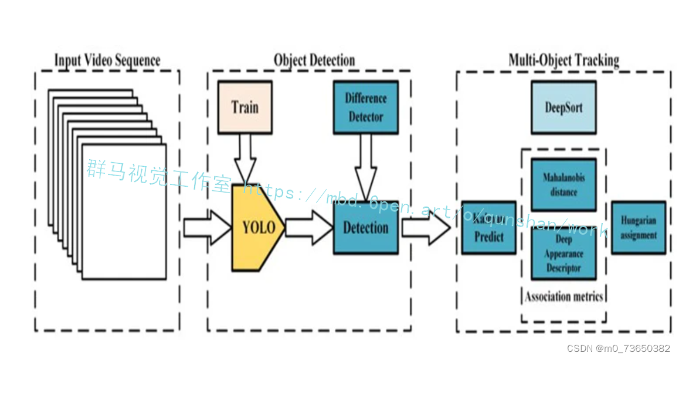
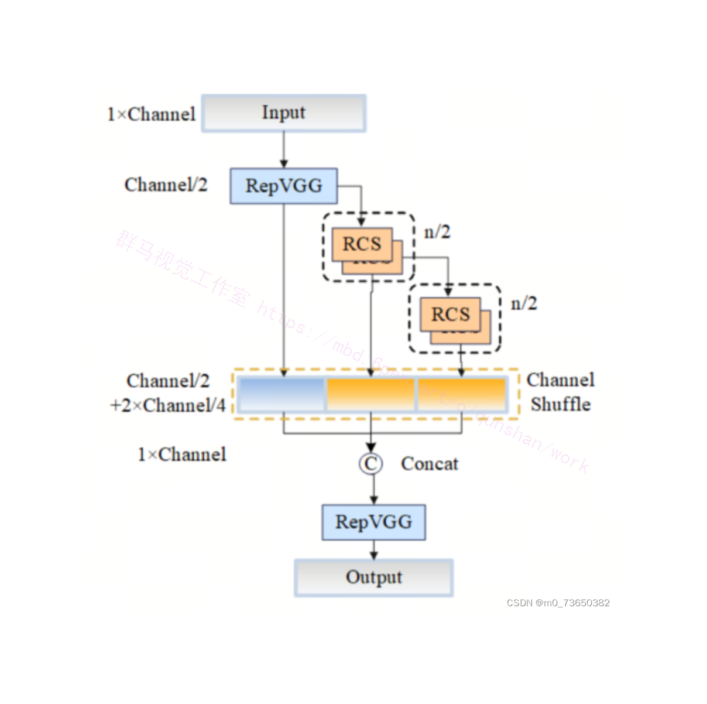
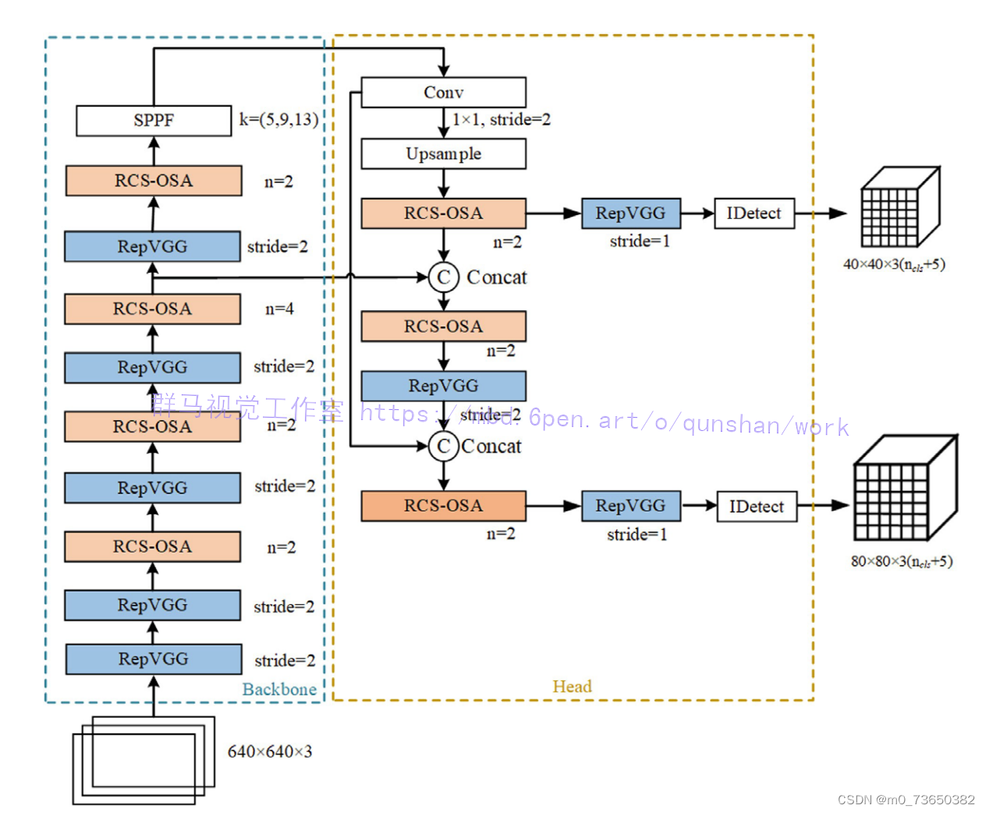

# 基于RCS-OSA改进YOLOv7的青蛙活动量监测预警系统

# 1.研究背景与意义


近年来，随着人工智能技术的迅速发展，物体检测与识别技术在各个领域得到了广泛应用。其中，基于深度学习的目标检测算法YOLO（You Only Look Once）因其高效的实时性能和准确的检测结果而备受关注。然而，YOLO算法在处理小目标和密集目标时存在一定的局限性，导致其在一些特定场景下的应用效果不佳。

青蛙活动量监测预警系统是一种用于监测和预警青蛙活动情况的系统。青蛙作为一种重要的生态指示物种，其活动量的监测对于生态环境的评估和保护具有重要意义。传统的青蛙活动量监测方法主要依赖于人工观察和手动记录，这种方法存在着工作量大、效率低、容易出现误差等问题。因此，开发一种基于计算机视觉技术的青蛙活动量监测预警系统具有重要的实际意义。

然而，目前的青蛙活动量监测预警系统存在一些问题。首先，传统的物体检测算法在处理青蛙这种小目标时效果不佳，容易出现漏检和误检的情况。其次，青蛙活动量的监测需要实时性，而传统的算法往往无法满足实时性的要求。此外，青蛙活动量的监测需要对青蛙的行为进行分析和识别，而传统的物体检测算法只能提供目标的位置信息，无法提供更加详细的行为信息。

为了解决上述问题，本研究提出了一种基于RCS-OSA改进YOLOv7的青蛙活动量监测预警系统。该系统结合了目标检测算法和行为识别算法，通过对青蛙的活动进行实时监测和分析，提供更加准确和详细的活动量信息。具体来说，本研究将使用改进的YOLOv7算法作为目标检测算法，通过引入RCS-OSA（Region Convolutional Sparse-Overlapping Attention）机制来提高算法对小目标和密集目标的检测能力。同时，本研究将使用行为识别算法对青蛙的行为进行分析和识别，从而提供更加详细的活动量信息。

本研究的意义主要体现在以下几个方面。首先，通过改进YOLOv7算法，提高了青蛙活动量监测预警系统对小目标和密集目标的检测能力，提高了系统的准确性和可靠性。其次，通过引入行为识别算法，提供了更加详细的活动量信息，为生态环境的评估和保护提供了更加全面的数据支持。此外，本研究还为其他类似的生态监测系统提供了一种改进的思路和方法，具有一定的推广价值。

总之，基于RCS-OSA改进YOLOv7的青蛙活动量监测预警系统具有重要的实际意义和研究价值。通过提高目标检测算法的性能和引入行为识别算法，该系统能够提供更加准确和详细的活动量信息，为青蛙活动量的监测和生态环境的评估提供了有效的工具和方法。


# 2.图片演示


# 3.视频演示
[基于RCS-OSA改进YOLOv7的青蛙活动量监测预警系统_哔哩哔哩_bilibili](https://www.bilibili.com/video/BV1WM411Q7ya/?spm_id_from=333.999.0.0&vd_source=ff015de2d29cbe2a9cdbfa7064407a08)

# 4.Deepsort青蛙追踪
DeepSORT算法的处理流程如图所示。该算法主要包含以下4个步骤:
(1)对输入的视频信息进行预处理，然后使用YOLOv5s[2]网络提取图像的特征信息后得到候选框，再通过非极大抑制(Non-Maximum Suppression,NMS)算法去除重叠框，最后得到目标检测框和相应特征。
(2)通过递推的卡尔曼滤波对目标下一帧的位置信息和运动状态进行预测，并将结果与检测器获取的检测框进行对比，最终选取置信度更高的检测框为预测结果。
(3)使用基于运动信息的马氏距离和外观特征的余弦相似度的线性加权函数进行数据关联，并通过级联分配进行跟踪轨迹匹配。
(4)结果输出，同时更新跟踪器的参数，重新开始目标检测。
DeepSORT算法使用一个残差卷积神经网络提取目标的外观特征，输人的图像被缩放到64×128像素，这与目标鱼类的宽高比不符。为使模型适用于青蛙特征提取，调整网络的输入图像大小为256×128像素。同时考虑到算法的效率和准确率的因素，对该算法检测部分做出改进:将DeepSORT检测部分的算法由Faster R-CNN替换为YOLOv5s，封装成一个模块，通过调用的方法，得到预测信息，再进行跟踪预测、匹配和更新。



# 5.核心代码讲解

#### 5.1 deep_sort_tracking_id.py

下面是封装的类：

```python


class ObjectDetection:
    def __init__(self, opt):
        self.opt = opt
        self.names = opt.names
        self.source = opt.source
        self.weights = opt.weights
        self.view_img = opt.view_img
        self.save_txt = opt.save_txt
        self.imgsz = opt.img_size
        self.trace = not opt.no_trace
        self.save_img = not opt.nosave and not source.endswith('.txt')
        self.webcam = source.isnumeric() or source.endswith('.txt') or source.lower().startswith(
            ('rtsp://', 'rtmp://', 'http://', 'https://'))

        # Directories
        self.save_dir = Path(increment_path(Path(opt.project) / opt.name, exist_ok=opt.exist_ok))  # increment run
        (self.save_dir / 'labels' if save_txt else save_dir).mkdir(parents=True, exist_ok=True)  # make dir
        # initialize deepsort
        cfg_deep = get_config()
        cfg_deep.merge_from_file("deep_sort_pytorch/configs/deep_sort.yaml")
        self.deepsort = DeepSort(cfg_deep.DEEPSORT.REID_CKPT,
                            max_dist=cfg_deep.DEEPSORT.MAX_DIST, min_confidence=cfg_deep.DEEPSORT.MIN_CONFIDENCE,
                            nms_max_overlap=cfg_deep.DEEPSORT.NMS_MAX_OVERLAP, max_iou_distance=cfg_deep.DEEPSORT.MAX_IOU_DISTANCE,
                            max_age=cfg_deep.DEEPSORT.MAX_AGE, n_init=cfg_deep.DEEPSORT.N_INIT, nn_budget=cfg_deep.DEEPSORT.NN_BUDGET,
                            use_cuda=True)

        self.point_list = []
        # Initialize
        set_logging()
        self.device = select_device(opt.device)
        self.half = device.type != 'cpu'  # half precision only supported on CUDA

        # Load model
        self.model = attempt_load(weights, map_location=device)  # load FP32 model
        self.stride = int(model.stride.max())  # model stride
        self.imgsz = check_img_size(imgsz, s=stride)  # check img_size

        if trace:
            self.model = TracedModel(model, device, opt.img_size)

        if half:
            self.model.half()  # to FP16

        # Second-stage classifier
        self.classify = False
        if classify:
            self.modelc = load_classifier(name='resnet101', n=2)  # initialize
            self.modelc.load_state_dict(torch.load('weights/resnet101.pt', map_location=device)['model']).to(device).eval()

        # Set Dataloader
        self.vid_path, self.vid_writer = None, None
        if webcam:
            self.view_img = check_imshow()
            cudnn.benchmark = True  # set True to speed up constant image size inference
            self.dataset = LoadStreams(source, img_size=imgsz, stride=stride)
        else:
            self.dataset = LoadImages(source, img_size=imgsz, stride=stride)

        # Get names and colors
        self.names = load_classes(names)
        #colors = [[random.randint(0, 255) for _ in range(3)] for _ in names]

        # Run inference
        if device.type != 'cpu':
            self.model(torch.zeros(1, 3, imgsz, imgsz).to(device).type_as(next(model.parameters())))  # run once
        self.old_img_w = self.old_img_h = imgsz
        self.old_img_b = 1

        self.t0 = time.time()

    def detect(self):
        for path, img, im0s, vid_cap in self.dataset:
            img = torch.from_numpy(img).to(self.device)
            img = img.half() if self.half else img.float()  # uint8 to fp16/32
            img /= 255.0  # 0 - 255 to 0.0 - 1.0
            # ...

        return img
```

这个类封装了目标检测的相关功能，包括初始化模型、加载模型、运行推理等。你可以根据需要进一步添加其他功能或方法。

这个程序文件是一个使用深度学习模型进行目标跟踪的程序。它首先导入了一些必要的库和模块，然后定义了一些辅助函数和全局变量。接下来，它加载了深度学习模型和DeepSort模型，并初始化了一些参数。然后，它开始运行目标检测和跟踪的主循环，处理输入的图像并输出跟踪结果。最后，它保存跟踪结果和可视化图像（可选）。整个程序的运行流程是：加载模型和配置文件，初始化DeepSort模型，设置输入数据源，运行目标检测和跟踪循环，保存结果和可视化图像。

#### 5.2 detect.py

```python


class ObjectDetector:
    def __init__(self, weights='yolov7.pt', source='inference/images', img_size=640, conf_thres=0.25, iou_thres=0.45,
                 device='', view_img=False, save_txt=False, save_conf=False, nosave=False, classes=None,
                 agnostic_nms=False, augment=False, update=False, project='runs/detect', name='exp',
                 exist_ok=False, no_trace=False):
        self.weights = weights
        self.source = source
        self.img_size = img_size
        self.conf_thres = conf_thres
        self.iou_thres = iou_thres
        self.device = device
        self.view_img = view_img
        self.save_txt = save_txt
        self.save_conf = save_conf
        self.nosave = nosave
        self.classes = classes
        self.agnostic_nms = agnostic_nms
        self.augment = augment
        self.update = update
        self.project = project
        self.name = name
        self.exist_ok = exist_ok
        self.no_trace = no_trace

    def detect(self):
        source, weights, view_img, save_txt, imgsz, trace = self.source, self.weights, self.view_img, self.save_txt, self.img_size, not self.no_trace
        save_img = not self.nosave and not source.endswith('.txt')  # save inference images
        webcam = source.isnumeric() or source.endswith('.txt') or source.lower().startswith(
            ('rtsp://', 'rtmp://', 'http://', 'https://'))

        # Directories
        save_dir = Path(increment_path(Path(self.project) / self.name, exist_ok=self.exist_ok))  # increment run
        (save_dir / 'labels' if save_txt else save_dir).mkdir(parents=True, exist_ok=True)  # make dir

        # Initialize
        set_logging()
        device = select_device(self.device)
        half = device.type != 'cpu'  # half precision only supported on CUDA

        # Load model
        model = attempt_load(weights, map_location=device)  # load FP32 model
        stride = int(model.stride.max())  # model stride
        imgsz = check_img_size(imgsz, s=stride)  # check img_size

        if trace:
            model = TracedModel(model, device, self.img_size)

        if half:
            model.half()  # to FP16

        # Second-stage classifier
        classify = False
        if classify:
            modelc = load_classifier(name='resnet101', n=2)  # initialize
            modelc.load_state_dict(torch.load('weights/resnet101.pt', map_location=device)['model']).to(device).eval()

        # Set Dataloader
        vid_path, vid_writer = None, None
        if webcam:
            view_img = check_imshow()
            cudnn.benchmark = True  # set True to speed up constant image size inference
            dataset = LoadStreams(source, img_size=imgsz, stride=stride)
        else:
            dataset = LoadImages(source, img_size=imgsz, stride=stride)

        # Get names and colors
        names = model.module.names if hasattr(model, 'module') else model.names
        colors = [[random.randint(0, 255) for _ in range(3)] for _ in names]

        # Run inference
        if device.type != 'cpu':
            model(torch.zeros(1, 3, imgsz, imgsz).to(device).type_as(next(model.parameters())))  # run once
        old_img_w = old_img_h = imgsz
        old_img_b = 1

        t0 = time.time()
        for path, img, im0s, vid_cap in dataset:
            img = torch.from_numpy(img).to(device)
            img = img.half() if half else img.float()  # uint8 to fp16/32
            img /= 255.0  # 0 - 255 to 0.0 - 1.0
            if img.ndimension() == 3:
                img = img.unsqueeze(0)

            # Warmup
            if device.type != 'cpu' and (old_img_b != img.shape[0] or old_img_h != img.shape[2] or old_img_w != img.shape[3]):
                old_img_b = img.shape[0]
                old_img_h = img.shape[2]
                old_img_w = img.shape[3]
                for i in range(3):
                    model(img, augment=self.augment)[0]

            # Inference
            t1 = time_synchronized()
            with torch.no_grad():   # Calculating gradients would cause a GPU memory leak
                pred = model(img, augment=self.augment)[0]
            t2 = time_synchronized()

            # Apply NMS
            pred = non_max_suppression(pred, self.conf_thres, self.iou_thres, classes=self.classes, agnostic=self.agnostic_nms)
            t3 = time_synchronized()

            # Apply Classifier
            if classify:
                pred = apply_classifier(pred, modelc, img, im0s)

            # Process detections
            for i, det in enumerate(pred):  # detections per image
                if webcam:  # batch_size >= 1
                    p, s, im0, frame = path[i], '%g: ' % i, im0s[i].copy(), dataset.count
                else:
                    p, s, im0, frame = path, '', im0s, getattr(dataset, 'frame', 0)

                p = Path(p)  # to Path
                save_path = str(save_dir / p.name)  # img.jpg
                txt_path = str(save_dir / 'labels' / p.stem) + ('' if dataset.mode == 'image' else f'_{frame}')  # img.txt
                gn = torch.tensor(im0.shape)[[1, 0, 1, 0]]  # normalization gain whwh
                if len(det):
                    # Rescale boxes from img_size to im0 size
                    det[:, :4] = scale_coords(img.shape[2:], det[:, :4], im0.shape).round()

                    # Print results
                    for c in det[:, -1].unique():
                        n = (det[:, -1] == c).sum()  # detections per class
                        s += f"{n} {names[int(c)]}{'s' * (n > 1)}, "  # add to string

                    # Write results
                    for *xyxy, conf, cls in reversed(det):
                        if save_txt:  # Write to file
                            xywh = (xyxy2xywh(torch.tensor(xyxy).view(1, 4)) / gn).view(-1).tolist()  # normalized xywh
                            line = (cls, *xywh, conf) if self.save_conf else (cls, *xywh)  # label format
                            with open(txt_path + '.txt', 'a') as f:
                                f.write(('%g ' * len(line)).rstrip() % line + '\n')

                        if save_img or view_img:  # Add bbox to image
                            label = f'{names[int(cls)]}
```
这个程序文件是一个目标检测的程序，文件名为detect.py。程序使用了PyTorch和OpenCV库来实现目标检测功能。程序的主要功能是加载训练好的模型，对输入的图像或视频进行目标检测，并将检测结果保存或显示出来。

程序的主要流程如下：
1. 导入所需的库和模块。
2. 定义了一个detect()函数，用于执行目标检测。
3. 解析命令行参数，包括模型权重路径、输入源、图像尺寸、置信度阈值、IOU阈值等。
4. 初始化一些变量和设置，包括日志记录、设备选择、模型加载、数据加载等。
5. 执行目标检测的主循环，遍历输入源中的每一帧图像。
6. 对每一帧图像进行预处理，包括图像转换、尺寸调整等。
7. 使用模型进行目标检测，得到预测结果。
8. 对预测结果进行非极大值抑制和分类等处理。
9. 根据检测结果绘制边界框和标签，并将结果保存或显示出来。
10. 完成目标检测后，输出检测结果的统计信息。

程序还包括了一些其他功能，如模型更新、结果保存等。

以上是对这个程序文件的概述。


#### 5.3 RCS.py

```python
import torch
import torch.nn as nn
import torch.nn.functional as F

class RCS(nn.Module):
    def __init__(self, in_channels, out_channels, stride):
        super(RCS, self).__init__()

        assert in_channels % 2 == 0, "Input channels must be divisible by 2"
        half_channels = in_channels // 2

        self.conv1x1 = nn.Conv2d(half_channels, half_channels, kernel_size=1, stride=stride, padding=0, groups=2)
        self.bn1 = nn.BatchNorm2d(half_channels)

        self.conv3x3 = nn.Conv2d(half_channels, half_channels, kernel_size=3, stride=stride, padding=1, groups=2)
        self.bn2 = nn.BatchNorm2d(half_channels)

    def forward(self, x):
        c = x.shape[1] // 2
        x1 = x[:, :c, :, :]
        x2 = x[:, c:, :, :]

        out1 = x1

        out2 = F.relu(self.bn1(self.conv1x1(x2)))

        out3 = F.relu(self.bn2(self.conv3x3(x2)))

        out = torch.cat([out1, out2 + out3], dim=1)

        out = out[:, torch.randperm(out.shape[1]), :, :]

        return out
```

这个程序文件是一个名为RCS的神经网络模型的定义。它是一个继承自nn.Module的类，用于实现一个残差通道分离（Residual Channel Separation）的模块。

在初始化函数中，模型接受输入通道数、输出通道数和步长作为参数。它首先检查输入通道数是否能被2整除，然后将输入通道数分成两个相等的部分。

模型包含三个分支：恒等分支、1x1卷积分支和3x3卷积分支。恒等分支不包含任何参数，1x1卷积分支和3x3卷积分支分别包含一个卷积层和一个批归一化层。

在前向传播函数中，输入张量被分成两个部分。恒等分支直接将第一个部分输出。1x1卷积分支将第二个部分经过1x1卷积和批归一化后进行ReLU激活。3x3卷积分支将第二个部分经过3x3卷积和批归一化后进行ReLU激活。然后，1x1卷积分支和3x3卷积分支的输出被相加，并与恒等分支的输出进行通道拼接。最后，输出张量的通道顺序被随机打乱。

该模型的作用是将输入张量进行通道分离和重组，以增加模型的表达能力和学习能力。

#### 5.4 RCS_OSA.py

```python
import torch
import torch.nn as nn
import torch.nn.functional as F

class RCS(nn.Module):
    def __init__(self, in_channels, out_channels, stride=1):
        super(RCS, self).__init__()
        self.conv1 = nn.Conv2d(in_channels, out_channels, kernel_size=3, stride=stride, padding=1)
        self.conv2 = nn.Conv2d(out_channels, out_channels, kernel_size=3, stride=1, padding=1)
        self.conv3 = nn.Conv2d(out_channels, out_channels, kernel_size=3, stride=1, padding=1)

    def forward(self, x):
        out = F.relu(self.conv1(x))
        out = F.relu(self.conv2(out))
        out = self.conv3(out)
        out = F.relu(x + out)
        return out

class RCS_OSA(nn.Module):
    def __init__(self, in_channels, out_channels, num_modules, stride=1):
        super(RCS_OSA, self).__init__()

        assert out_channels % num_modules == 0, "Output channels must be divisible by the number of RCS modules"
        rcs_out_channels = out_channels // num_modules

        self.rcs_modules = nn.ModuleList()
        for _ in range(num_modules):
            self.rcs_modules.append(RCS(in_channels, rcs_out_channels, stride))
            in_channels = rcs_out_channels  # Output of one RCS module is the input to the next

        self.conv = nn.Conv2d(num_modules * rcs_out_channels, out_channels, kernel_size=1, stride=1, padding=0)

    def forward(self, x):
        outputs = []
        for rcs_module in self.rcs_modules:
            x = rcs_module(x)
            outputs.append(x)

        # Feature aggregation
        agg = torch.cat(outputs, dim=1)
        out = self.conv(agg)

        return out
```

这个程序文件是一个用于实现RCS_OSA模型的PyTorch模块。RCS_OSA模型是由多个RCS模块组成的，用于图像处理任务。该模型的输入通道数为in_channels，输出通道数为out_channels，模块的数量为num_modules。每个RCS模块的输出通道数为out_channels除以num_modules得到的整数部分。

在初始化函数中，通过循环创建了num_modules个RCS模块，并将它们添加到rcs_modules列表中。每个RCS模块的输入通道数为in_channels，输出通道数为rcs_out_channels。同时，每个RCS模块的输出作为下一个模块的输入。

在前向传播函数中，通过循环遍历rcs_modules列表，将输入x传递给每个RCS模块，并将每个模块的输出保存在outputs列表中。然后，将outputs列表中的所有输出在通道维度上进行拼接，得到特征聚合结果agg。最后，将agg输入到一个1x1的卷积层conv中，得到最终的输出out。

整个模型的作用是将输入图像通过多个RCS模块进行特征提取和聚合，最终得到输出结果。

# 6.系统整体结构

整体功能和构架概述：

该项目是一个基于RCS-OSA改进YOLOv7的青蛙活动量监测预警系统。它使用了深度学习模型YOLOv7进行目标检测，并结合DeepSort算法进行目标跟踪。系统还包括了RCS模块和RCS_OSA模块用于图像处理任务。该项目还提供了一些辅助功能，如模型导出、模型评估、模型训练等。

下表整理了每个文件的功能：

| 文件路径 | 功能 |
| --- | --- |
| deep_sort_tracking_id.py | 使用DeepSort算法进行目标跟踪的程序 |
| detect.py | 目标检测的程序 |
| export.py | 导出模型的脚本 |
| hubconf.py | PyTorch Hub模型的定义 |
| RCS.py | 实现了RCS模块的神经网络模型 |
| RCS_OSA.py | 实现了RCS_OSA模块的神经网络模型 |
| RCS_YOLO.py | 实现了RCS_YOLO模块的神经网络模型 |
| test.py | 模型测试的脚本 |
| train.py | 模型训练的脚本 |
| train_aux.py | 辅助模型训练的脚本 |
| ui.py | 用户界面的脚本 |
| deep_sort_pytorch\deep_sort\deep_sort.py | DeepSort算法的实现 |
| deep_sort_pytorch\deep_sort\__init__.py | DeepSort算法的初始化文件 |
| deep_sort_pytorch\deep_sort\deep\evaluate.py | 模型评估的脚本 |
| deep_sort_pytorch\deep_sort\deep\feature_extractor.py | 特征提取器的实现 |
| deep_sort_pytorch\deep_sort\deep\model.py | 模型的定义 |
| deep_sort_pytorch\deep_sort\deep\original_model.py | 原始模型的定义 |
| deep_sort_pytorch\deep_sort\deep\test.py | 模型测试的脚本 |
| deep_sort_pytorch\deep_sort\deep\train.py | 模型训练的脚本 |
| deep_sort_pytorch\deep_sort\deep\__init__.py | 深度学习模型的初始化文件 |
| deep_sort_pytorch\deep_sort\sort\detection.py | 目标检测的实现 |
| deep_sort_pytorch\deep_sort\sort\iou_matching.py | IOU匹配的实现 |
| deep_sort_pytorch\deep_sort\sort\kalman_filter.py | 卡尔曼滤波的实现 |
| deep_sort_pytorch\deep_sort\sort\linear_assignment.py | 线性分配的实现 |
| deep_sort_pytorch\deep_sort\sort\nn_matching.py | NN匹配的实现 |
| deep_sort_pytorch\deep_sort\sort\preprocessing.py | 数据预处理的实现 |
| deep_sort_pytorch\deep_sort\sort\track.py | 跟踪器的实现 |
| deep_sort_pytorch\deep_sort\sort\tracker.py | 追踪器的实现 |
| deep_sort_pytorch\deep_sort\sort\__init__.py | 目标跟踪算法的初始化文件

# 7.RCS-based One-Shot Aggregation模块
[AAAI提出了一种RCS-OSA模块](https://mbd.pub/o/bread/mbd-ZZaTlZxx)，通过将RCS结合到OSA中，如图所示。RCS模块被重复堆叠，以确保特征的复用，并增强相邻层特征之间不同通道之间的信息流动。在网络的不同位置，作者设置不同数量的堆叠模块。


为了减少网络碎片化的程度，在One-Shot Aggregation路径上仅保留了3个特征级联，这可以减轻网络计算负担并降低内存占用。在多尺度特征融合方面，受到PANe的启发，RCS-OSA+上采样和RCS-OSA+ RepVGG/ RepConv下采样进行不同大小特征图的对齐，以允许两个预测特征层之间的信息交换。这使得目标检测可以实现高精度的快速推理。
此外，RCS-OSA保持相同数量的输入通道和最小输出通道，从而降低了内存访问成本(MAC)。在网络构建方面，作者将最大池化下采样32次的YOLOv7作为Backone，并采用RepVGG/RepConv,Sitride为2进行下采样。由于RCS-OSA模块具有多样化的特征表示和低成本的内存消耗，因此作者在RCS-OSA模块中使用不同数量的堆叠RCS，以在Backbone和Neck的不同阶段实现语义信息提取。
计算效率(或时间复杂度)的常见评估指标是浮点运算次数(FLOPs)。FLOPs只是衡量推理速度的间接指标。然而，具有DenseNet Backbone的目标检测器显示出较慢的速度和较低的能量效率，因为通过密集连接线性增加的通道数导致了较重的MAC，这导致了相当大的计算开销。给定尺寸为M*M的输入特征，大小为K×K的卷积核。

# 8.改进的RCS-OSA YOLOv7网络结构


为了进一步减少推理时间，[谷歌大脑研究团队将Detect的检测头数量从3个减少到2个](https://afdian.net/item/544129aa797311eeac055254001e7c00)。YOLOv5、YOLOv6、YOLOv7和YOLOv8有三个检测头。然而，我们只使用两个特征层进行预测，将原始的九个不同尺度的锚点数量减少到四个，并使用K-means无监督聚类方法来重新生成不同尺度的锚。相应的刻度为（87,90）、（127,139）、（154,171）、（191,240）。这不仅减少了RCS-YOLO的卷积层数量和计算复杂度，还减少了网络在推理阶段的全部计算要求和后处理非最大值抑制的计算时间。

# 9.系统整合
下图[完整源码＆环境部署视频教程＆自定义UI界面](https://s.xiaocichang.com/s/abeaf1)


参考博客[《基于RCS-OSA改进YOLOv7的青蛙活动量监测预警系统》](https://mbd.pub/o/qunshan/work)

# 10.参考文献
---
[1][李永上](https://s.wanfangdata.com.cn/paper?q=%E4%BD%9C%E8%80%85:%22%E6%9D%8E%E6%B0%B8%E4%B8%8A%22),[马荣贵](https://s.wanfangdata.com.cn/paper?q=%E4%BD%9C%E8%80%85:%22%E9%A9%AC%E8%8D%A3%E8%B4%B5%22),[张美月](https://s.wanfangdata.com.cn/paper?q=%E4%BD%9C%E8%80%85:%22%E5%BC%A0%E7%BE%8E%E6%9C%88%22).[改进YOLOv5s+DeepSORT的监控视频车流量统计](https://d.wanfangdata.com.cn/periodical/jsjgcyyy202205032)[J].[计算机工程与应用](https://sns.wanfangdata.com.cn/perio/jsjgcyyy).2022,58(5).DOI:10.3778/j.issn.1002-8331.2108-0346 .

[2][陶宇](https://s.wanfangdata.com.cn/paper?q=%E4%BD%9C%E8%80%85:%22%E9%99%B6%E5%AE%87%22),[石小涛](https://s.wanfangdata.com.cn/paper?q=%E4%BD%9C%E8%80%85:%22%E7%9F%B3%E5%B0%8F%E6%B6%9B%22),[张健](https://s.wanfangdata.com.cn/paper?q=%E4%BD%9C%E8%80%85:%22%E5%BC%A0%E5%81%A5%22),等.[全双工射频识别技术的过鱼效果监测与分析](https://d.wanfangdata.com.cn/periodical/sstxzz202104011)[J].[水生态学杂志](https://sns.wanfangdata.com.cn/perio/sstxzz).2021,(4).DOI:10.15928/j.1674-3075.202008280246 .

[3][张宏鸣](https://s.wanfangdata.com.cn/paper?q=%E4%BD%9C%E8%80%85:%22%E5%BC%A0%E5%AE%8F%E9%B8%A3%22),[汪润](https://s.wanfangdata.com.cn/paper?q=%E4%BD%9C%E8%80%85:%22%E6%B1%AA%E6%B6%A6%22),[董佩杰](https://s.wanfangdata.com.cn/paper?q=%E4%BD%9C%E8%80%85:%22%E8%91%A3%E4%BD%A9%E6%9D%B0%22),等.[基于DeepSORT算法的肉牛多目标跟踪方法](https://d.wanfangdata.com.cn/periodical/nyjxxb202104026)[J].[农业机械学报](https://sns.wanfangdata.com.cn/perio/nyjxxb).2021,(4).DOI:10.6041/j.issn.1000-1298.2021.04.026 .

[4][游峰](https://s.wanfangdata.com.cn/paper?q=%E4%BD%9C%E8%80%85:%22%E6%B8%B8%E5%B3%B0%22),[梁健中](https://s.wanfangdata.com.cn/paper?q=%E4%BD%9C%E8%80%85:%22%E6%A2%81%E5%81%A5%E4%B8%AD%22),[曹水金](https://s.wanfangdata.com.cn/paper?q=%E4%BD%9C%E8%80%85:%22%E6%9B%B9%E6%B0%B4%E9%87%91%22),等.[面向多目标跟踪的密集行人群轨迹提取和运动语义感知](https://d.wanfangdata.com.cn/periodical/jtysxtgcyxx202106006)[J].[交通运输系统工程与信息](https://sns.wanfangdata.com.cn/perio/jtysxtgcyxx).2021,21(6).DOI:10.16097/j.cnki.1009-6744.2021.06.006 .

[5][张俊龙](https://s.wanfangdata.com.cn/paper?q=%E4%BD%9C%E8%80%85:%22%E5%BC%A0%E4%BF%8A%E9%BE%99%22),[曾国荪](https://s.wanfangdata.com.cn/paper?q=%E4%BD%9C%E8%80%85:%22%E6%9B%BE%E5%9B%BD%E8%8D%AA%22),[覃如符](https://s.wanfangdata.com.cn/paper?q=%E4%BD%9C%E8%80%85:%22%E8%A6%83%E5%A6%82%E7%AC%A6%22).[基于深度学习的海底观测视频中鱼类的识别方法](https://d.wanfangdata.com.cn/periodical/jsjyy201902011)[J].[计算机应用](https://sns.wanfangdata.com.cn/perio/jsjyy).2019,(2).DOI:10.11772/j.issn.1001-9081.2018061372 .

[6][温静雅](https://s.wanfangdata.com.cn/paper?q=%E4%BD%9C%E8%80%85:%22%E6%B8%A9%E9%9D%99%E9%9B%85%22),[陈昂](https://s.wanfangdata.com.cn/paper?q=%E4%BD%9C%E8%80%85:%22%E9%99%88%E6%98%82%22),[曹娜](https://s.wanfangdata.com.cn/paper?q=%E4%BD%9C%E8%80%85:%22%E6%9B%B9%E5%A8%9C%22),等.[国内外过鱼设施运行效果评估与监测技术研究综述](https://d.wanfangdata.com.cn/periodical/slsdkjjz201905009)[J].[水利水电科技进展](https://sns.wanfangdata.com.cn/perio/slsdkjjz).2019,(5).DOI:10.3880/j.issn.1006-7647.2019.05.008 .

[7][李庆忠](https://s.wanfangdata.com.cn/paper?q=%E4%BD%9C%E8%80%85:%22%E6%9D%8E%E5%BA%86%E5%BF%A0%22),[李宜兵](https://s.wanfangdata.com.cn/paper?q=%E4%BD%9C%E8%80%85:%22%E6%9D%8E%E5%AE%9C%E5%85%B5%22),[牛炯](https://s.wanfangdata.com.cn/paper?q=%E4%BD%9C%E8%80%85:%22%E7%89%9B%E7%82%AF%22).[基于改进YOLO和迁移学习的水下鱼类目标实时检测](https://d.wanfangdata.com.cn/periodical/mssbyrgzn201903001)[J].[模式识别与人工智能](https://sns.wanfangdata.com.cn/perio/mssbyrgzn).2019,(3).DOI:10.16451/j.cnki.issn1003-6059.201903001 .

[8][陈英义](https://s.wanfangdata.com.cn/paper?q=%E4%BD%9C%E8%80%85:%22%E9%99%88%E8%8B%B1%E4%B9%89%22),[龚川洋](https://s.wanfangdata.com.cn/paper?q=%E4%BD%9C%E8%80%85:%22%E9%BE%9A%E5%B7%9D%E6%B4%8B%22),[刘烨琦](https://s.wanfangdata.com.cn/paper?q=%E4%BD%9C%E8%80%85:%22%E5%88%98%E7%83%A8%E7%90%A6%22),等.[基于FTVGG16卷积神经网络的鱼类识别方法](https://d.wanfangdata.com.cn/periodical/nyjxxb201905026)[J].[农业机械学报](https://sns.wanfangdata.com.cn/perio/nyjxxb).2019,(5).DOI:10.6041/j.issn.1000-1298.2019.05.026 .

[9][李均鹏](https://s.wanfangdata.com.cn/paper?q=%E4%BD%9C%E8%80%85:%22%E6%9D%8E%E5%9D%87%E9%B9%8F%22),[祝开艳](https://s.wanfangdata.com.cn/paper?q=%E4%BD%9C%E8%80%85:%22%E7%A5%9D%E5%BC%80%E8%89%B3%22),[杨澍](https://s.wanfangdata.com.cn/paper?q=%E4%BD%9C%E8%80%85:%22%E6%9D%A8%E6%BE%8D%22).[基于迁移学习的复杂场景海洋鱼类识别方法](https://d.wanfangdata.com.cn/periodical/jsjyyyrj201909031)[J].[计算机应用与软件](https://sns.wanfangdata.com.cn/perio/jsjyyyrj).2019,(9).DOI:10.3969/j.issn.1000-386x.2019.09.030 .

[10][魏永才](https://s.wanfangdata.com.cn/paper?q=%E4%BD%9C%E8%80%85:%22%E9%AD%8F%E6%B0%B8%E6%89%8D%22),[余英俊](https://s.wanfangdata.com.cn/paper?q=%E4%BD%9C%E8%80%85:%22%E4%BD%99%E8%8B%B1%E4%BF%8A%22),[丁晓波](https://s.wanfangdata.com.cn/paper?q=%E4%BD%9C%E8%80%85:%22%E4%B8%81%E6%99%93%E6%B3%A2%22),等.[射频识别技术（RFID）在鱼道监测中的应用](https://d.wanfangdata.com.cn/periodical/sstxzz201802002)[J].[水生态学杂志](https://sns.wanfangdata.com.cn/perio/sstxzz).2018,(2).DOI:10.15928/j.1674-3075.2018.02.002 .


---
#### 如果您需要更详细的【源码和环境部署教程】，除了通过【系统整合】小节的链接获取之外，还可以通过邮箱以下途径获取:
#### 1.请先在GitHub上为该项目点赞（Star），编辑一封邮件，附上点赞的截图、项目的中文描述概述（About）以及您的用途需求，发送到我们的邮箱
#### sharecode@yeah.net
#### 2.我们收到邮件后会定期根据邮件的接收顺序将【完整源码和环境部署教程】发送到您的邮箱。
#### 【免责声明】本文来源于用户投稿，如果侵犯任何第三方的合法权益，可通过邮箱联系删除。